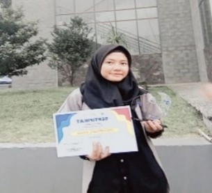
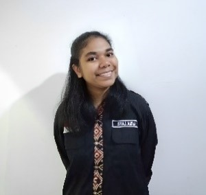

# Judul Naskah: MEMBANGUN WEBSITE BERBASIS CLOUD MENGGUNAKAN GOLANG DAN MONGODB Transformasi Digital BLKK Al-Ittifaq dengan Website Berbasis Cloud

## Sinopsis

Dalam era digital yang semakin maju, kebutuhan untuk memahami dan menguasai teknologi cloud menjadi semakin penting. Buku "Membangun Website Berbasis Cloud menggunakan Golang dan MongoDB" adalah panduan praktis bagi siapa saja yang ingin belajar membuat website berbasis cloud.

Dengan pendekatan langkah demi langkah, buku ini mengajarkan cara menginstal dan mengkonfigurasi Golang serta MongoDB, dan cara membangun aplikasi yang efisien dan mudah dikembangkan. Setiap chapter menyediakan contoh kode nyata yang dapat diakses melalui repositori GitHub, memungkinkan pembaca untuk langsung mempraktikkan apa yang mereka pelajari. 

Buku ini menggunakan website BLKK Al-Ittifaq sebagai contoh nyata untuk menunjukkan penerapan konsep dan teknologi yang dibahas. Proyek ini memberikan gambaran praktis tentang bagaimana teknologi cloud dapat diterapkan dalam konteks dunia nyata, dan bagaimana langkah-langkah yang dijelaskan dapat digunakan untuk membangun aplikasi web yang fungsional dan modern.

## Biografi Penulis

### Nama Penulis 1

Dwi Puspa Firdaus, lahir di Bandung pada tanggal 08 Agustus 2005. Pendidikan tingkat dasar hingga menengah ditempuh di Bandung. Melanjutkan Pendidikan di Universitas Logistik dan Bisnis Internasional Di Fakultas Sekolah Vokasi. Mengambil program D4 Teknik Informastika. Aktif sebagai Atlet Panahan Kabupaten Bandung. 

### Nama Penulis 2

Lusia Barek Lawe, lahir di Kota Sorong pada tanggal 13 Desember 2001. Menjalani masa sekolah dasar hingga kelas 5 di Sorong, Papua Barat, kemudian pindah dan menyelesaikan kelas 6 SD di Flores Timur, NTT. Melanjutkan pendidikan menengah pertama hingga menengah atas (SMA) di Flores Timur, NTT. Selama masa SMA, saya aktif terlibat dalam OSIS, yang membantu saya belajar berkolaborasi dan berorganisasi. Setelah menyelesaikan sekolah menengah atas, melanjutkan Pendidikan di Fakultas Sekolah Vokasi Universitas Logistik dan Bisnis Internasional, mengambil jurusan D4 Teknik Informatika.

### Nama Penulis 3

Rolly Maulana Awangga, lahir di Kota Indramayu pada tanggal 10 November 1986. Pendidikan tingkat dasar hingga menengah ditempuh di Indramayu. Mulai merantau sejak SMA, melatih kemandiriannya di SMKAMU Cirebon dengan aktif organisasi PPS Betako Merpati Putih, Pengurus OSIS dan Pendiri Dewan Keamanan Sekolah. Melanjutkan pendidikan S1 di STT Telkom, S2 di IT Telkom Bandung. Selama kuliah aktif sebagai TLH Telkom, pengurus Klub Linux Bandung, Pengurus Bandung Kota Blogger, Pendiri Saung IT dan wartawan Pikiran Rakyat. Menjadi tenaga ahli dan konsultan di aplikasi SDDKN Sekretariat Negara, Aplikasi Kementrian Hukum dan Ham, Team DevOps Pekan Olahraga Nasional, Cloud Architect Aplikasi Asesment Madrasah Kementrian Agama.

## Cover Buku

