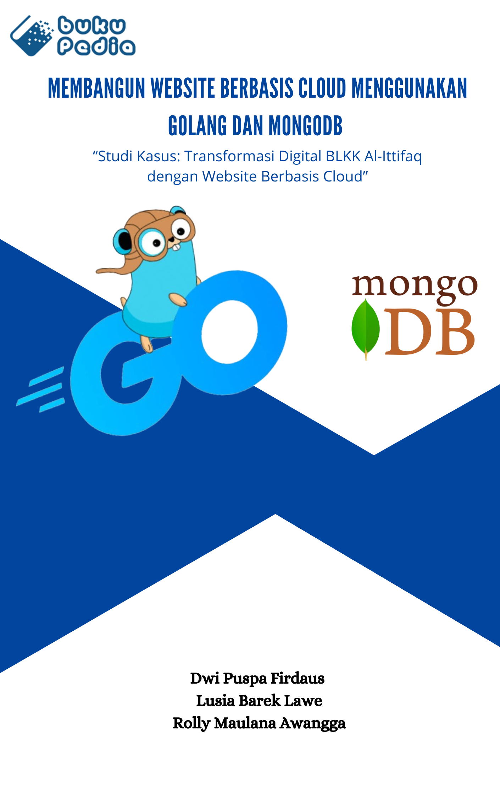

# Judul Naskah: MEMBANGUN WEBSITE BERBASIS CLOUD MENGGUNAKAN GOLANG DAN MONGODB “Studi Kasus: Transformasi Digital BLKK Al-Ittifaq dengan Website Berbasis Cloud”

## Sinopsis

Dalam era digital yang semakin maju, kebutuhan untuk memahami dan menguasai teknologi cloud menjadi semakin penting. Buku "Membangun Website Berbasis Cloud menggunakan Golang dan MongoDB" adalah panduan praktis bagi siapa saja yang ingin belajar membuat website berbasis cloud.

Dengan pendekatan langkah demi langkah, buku ini mengajarkan cara menginstal dan mengkonfigurasi Golang serta MongoDB, dan cara membangun aplikasi yang efisien dan mudah dikembangkan.

Setiap chapter menyediakan contoh kode nyata yang dapat diakses melalui repositori GitHub, memungkinkan pembaca untuk langsung mempraktikkan apa yang mereka pelajari. 

Studi kasus yang dibahas dalam buku ini merujuk pada proyek konkret, yaitu pengembangan website untuk BLKK Alittifaq. Proyek ini digunakan sebagai contoh aplikasi nyata dari konsep dan teknologi yang dibahas.

## Biografi Penulis

### Nama Penulis 1

Dwi Puspa Firdaus, lahir di Bandung pada tanggal 08 Agustus 2005. Pendidikan tingkat dasar hingga menengah ditempuh di Bandung. Melanjutkan Pendidikan di Universitas Logistik dan Bisnis Internasional Di Fakultas Sekolah Vokasi. Mengambil program D4 Teknik Informastika. Aktif sebagai Atlet Panahan Kabupaten Bandung. 

### Nama Penulis 2

Lusia Barek Lawe, lahir di Kota Sorong pada tanggal 13 Desember 2001. Menjalani masa sekolah dasar hingga kelas 5 di Sorong, Papua Barat, kemudian pindah dan menyelesaikan kelas 6 SD di Flores Timur, NTT. Melanjutkan pendidikan menengah pertama hingga menengah atas (SMA) di Flores Timur, NTT. Selama masa SMA, saya aktif terlibat dalam OSIS, yang membantu saya belajar berkolaborasi dan berorganisasi. Setelah menyelesaikan sekolah menengah atas, melanjutkan Pendidikan di Fakultas Sekolah Vokasi Universitas Logistik dan Bisnis Internasional, mengambil jurusan D4 Teknik Informatika.

### Nama Penulis 3

Rolly Maulana Awangga, lahir di Kota Indramayu pada tanggal 10 November 1986. Pendidikan tingkat dasar hingga menengah ditempuh di Indramayu. Mulai merantau sejak SMA, melatih kemandiriannya di SMKAMU Cirebon dengan aktif organisasi PPS Betako Merpati Putih, Pengurus OSIS dan Pendiri Dewan Keamanan Sekolah. Melanjutkan pendidikan S1 di STT Telkom, S2 di IT Telkom Bandung. Selama kuliah aktif sebagai TLH Telkom, pengurus Klub Linux Bandung, Pengurus Bandung Kota Blogger, Pendiri Saung IT dan wartawan Pikiran Rakyat. Menjadi tenaga ahli dan konsultan di aplikasi SDDKN Sekretariat Negara, Aplikasi Kementrian Hukum dan Ham, Team DevOps Pekan Olahraga Nasional, Cloud Architect Aplikasi Asesment Madrasah Kementrian Agama.

## Cover Buku

# Pengenalan BLKK Al-Ittifaq: Website Dinamis dengan Golang

## CHAPTER 1: PENDAHULUAN

### 1.1 PENGENALAN WEBSITE BERBASIS CLOUD

Website berbasis cloud itu adalah website yang nyimpen semua data dan programnya di internet alias cloud. Jadi, gak perlu repot-repot nyiapin server sendiri. Cloud computing ini banyak untungnya, misalnya bisa dipakai banyak orang, bisa diakses kapan aja, dan tentunya hemat biaya. Dengan cloud, kita bisa nambahin atau ngurangin kapasitas server sesuai kebutuhan tanpa harus beli hardware tambahan. Fleksibel banget, kan?

Beberapa penyedia layanan cloud yang terkenal itu ada Amazon Web Services (AWS), Google Cloud Platform (GCP), sama Microsoft Azure. Mereka menyediakan segala macem yang kamu butuhin buat website, kayak server virtual, penyimpanan, jaringan, sampai database (Mell & Grance, 2011). Jadi, kita bisa fokus ngembangin website tanpa harus mikirin ribetnya ngurusin server sendiri. Plus, mereka juga punya fitur keamanan yang mumpuni buat lindungin data kita dari ancaman luar.

Di cloud, kita bayar sesuai penggunaan (pay-as-you-go). Jadi, cuma bayar yang kita pakai aja, gak ada biaya tambahan yang gak perlu. Ini bagus banget buat hemat biaya, apalagi buat bisnis yang masih merintis. Gak perlu pusing mikirin biaya maintenance dan upgrade server, semua udah diurus sama penyedia layanan cloud (Armbrust et al., 2010).

Cloud computing juga mendukung kolaborasi tim yang lebih efektif. Tim bisa kerja bareng dari mana aja, kapan aja, karena semua data dan aplikasi disimpan di cloud. Ini cocok banget buat kerja remote atau punya tim yang tersebar di berbagai lokasi. Dengan semua keuntungan ini, gak heran kalo banyak perusahaan sekarang beralih ke cloud computing.

### 1.2 PENGENALAN GOLANG

Golang, atau biasa dipanggil Go, adalah bahasa pemrograman yang dikembangin sama Google. Pertama kali muncul tahun 2009, bahasa ini dibuat buat memenuhi kebutuhan program modern yang butuh performa tinggi, efisien, dan bisa diandalkan (Donovan & Kernighan, 2015). Go dirancang buat jadi solusi buat masalah yang sering muncul di bahasa pemrograman lain, kayak kecepatan kompilasi dan manajemen dependency.

Golang punya sintaks yang simple dan gampang dipelajarin. Salah satu kelebihan utamanya itu bisa jalanin banyak tugas sekaligus (concurrency) pake goroutines dan channels. Ini bikin Golang keren banget buat bikin aplikasi yang multitasking tanpa ngorbanin performa. Jadi, misalnya kamu mau bikin server web yang bisa handle banyak request sekaligus, Go bakal jalanin tugas ini dengan efisien (Cox-Buday, 2017).

Selain itu, Golang juga punya kompiler yang cepet dan hasilkan binary executable yang efisien, bisa dijalanin di berbagai platform tanpa tambahan apa-apa. Jadi, cocok banget buat bikin aplikasi web, sistem terdistribusi, dan microservices. Go juga didukung sama komunitas yang aktif, jadi kalau ada masalah atau butuh library tambahan, bisa gampang cari solusinya di internet.

Banyak perusahaan besar yang udah pake Golang buat aplikasi mereka, kayak Google, Uber, dan Dropbox. Ini nunjukin kalo Golang emang bisa diandalkan buat aplikasi skala besar. Dengan semua kelebihan ini, gak heran kalo Golang makin populer di kalangan developer.

1.3 PENGENALAN MONGODB
MongoDB adalah database NoSQL yang open-source dan nyimpen data dalam format dokumen JSON. Dibuat oleh MongoDB Inc., database ini didesain buat nangani volume data yang besar, performa tinggi, dan fleksibel buat ngurus data yang gak terstruktur (Chodorow, 2013). MongoDB banyak dipake di aplikasi modern yang butuh penyimpanan data yang scalable dan dinamis.

MongoDB beda sama database relasional yang pake tabel dan baris. MongoDB pake koleksi dan dokumen. Setiap dokumen itu objek JSON yang strukturnya bisa beda-beda. Jadi, bisa nyimpen data yang kompleks dan dinamis tanpa harus pake skema yang kaku. Fleksibilitas ini bikin MongoDB cocok buat berbagai jenis aplikasi, dari e-commerce sampe analisis data (Banker, 2011).

MongoDB punya fitur keren kayak replikasi buat ketersediaan tinggi, sharding buat skalabilitas horizontal, dan indexing buat query yang cepet. Dukungan buat berbagai bahasa pemrograman dan platform bikin MongoDB populer buat aplikasi web modern yang butuh penyimpanan data yang scalable dan fleksibel. MongoDB juga gampang diintegrasiin sama teknologi lain, kayak Node.js, Python, dan banyak lagi.

Banyak perusahaan besar yang pake MongoDB buat aplikasi mereka, kayak eBay, Adobe, dan LinkedIn. Dengan fitur-fiturnya yang canggih, MongoDB jadi pilihan favorit buat nyimpen data yang butuh fleksibilitas dan performa tinggi. Jadi, buat kamu yang lagi nyari database yang bisa diandalkan, MongoDB bisa jadi pilihan yang pas.

## CHAPTER 2 PERSIAPAN LINGKUNGAN PENGEMBANGAN

### 2.1 INSTALASI VISUAL STUDIA CODE

Visual Studio Code adalah sebuah
teks editor ringan dan handal yang dibuat
oleh Microsoft untuk sistem operasi
multiplatform, artinya tersedia juga untuk
versi Linux, Mac, dan Windows.
langkah-langkah untuk menginstalnya:

1. Kunjungi situs resmi Visual Stusio Code. Anda bisa menikuti tautan ini https://code.visualstudio.com/
2. Pilih versi yang sesuai dengan sistem operasi Anda (Windows, macOS, atau Linux).

### 2.2 INSTALASI GOLANG

Golang adalah bahasa pemrograman yang akan digunakan untuk mengembangkan backend website.
Cara instalasinya berbeda-beda untuk tiap jenis sistem operasi. Panduan instalasi Golang sebenarnya sudah disediakan, bisa dilihat di situs officialnya http://golang.org/doc/install#install.

### 2.3 INSTALASI GIT

Git adalah sistem kontrol versi yang akan membantu Anda mengelola kode sumber proyek. Berikut adalah langkah-langkah untuk menginstalnya:
1.. Download Git: kunjungi situs resmi Git https://www.git-scm.com/downloads 2. Pilih versi yang sesuai dengan sistem operasi Anda.

## CHAPTER 3 CHAPTER 3 DEPLOYMENT DAN HOSTING

### 3.1 Menyiapkan Akun Cloudflare

Langkah-langkah untuk Membuat Akun Cloudflare dan Mengkonfigurasinya KE Website

• Buka Website Cloudflare:
Kunjungi situs Cloudflare di www.cloudflare.com.
• Daftar atau Masuk:
Kalau belum punya akun, klik "Sign Up" dan daftar. Kalau udah punya, klik "Log In" dan masuk.
• Tambahkan Website:
Setelah masuk, klik "Add a Site".
• Masukkan Domain:
Ketik nama domain website kamu dan klik "Add site".
• Pilih Paket:
Pilih paket yang kamu mau. Paket gratis juga udah oke kok.
• Konfigurasi DNS:
Cloudflare bakal ngecek pengaturan DNS domain kamu. Cek apakah semuanya udah bener atau tambahin record yang kurang.
• Perbarui Nameserver:
Cloudflare bakal kasih dua nameserver. Ganti nameserver domain kamu di registrar (contohnya, Hostinger) dengan nameserver dari Cloudflare.
• Verifikasi:
Setelah nameserver diganti, balik lagi ke Cloudflare dan klik "Done, check nameservers". Tunggu beberapa menit sampai Cloudflare selesai verifikasi.

### 3.2 Menyiapkan Domain di Hostinger

Cara Membeli dan Mengkonfigurasi Domain di Hostinger untuk Website

• Buka Website Hostinger:
Kunjungi www.hostinger.com.
• Daftar atau Masuk:
Klik "Sign Up" buat daftar akun baru atau "Log In" kalau udah punya akun.
• Cari Domain:
Gunakan fitur pencarian domain buat nyari domain yang kamu mau. Masukkan nama domain dan klik "Search".
• Pilih Domain:
Kalau domainnya tersedia, klik "Add to cart" dan lanjutkan ke proses pembayaran.
• Beli Domain:
Ikuti proses checkout dan selesaikan pembayaran buat domain yang kamu pilih.
• Konfigurasi DNS:
Setelah pembelian selesai, masuk ke dashboard Hostinger, pilih "Domains", dan klik domain yang baru kamu beli. Arahkan ke bagian DNS buat mengkonfigurasi nameserver atau record DNS yang diperlukan.

### 3.3 Menyiapkan Akun GCP (Google Cloud Platform)

Panduan untuk Membuat Akun GCP dan Menyiapkan Proyek untuk Hosting
• Buka Google Cloud Platform:
Kunjungi cloud.google.com.
• Daftar atau Masuk:
Klik "Get Started for Free" buat daftar akun baru atau "Sign In" kalau udah punya akun.
• Konfirmasi Detail:
Ikuti langkah-langkah buat konfirmasi detail akun kamu, termasuk verifikasi identitas dan metode pembayaran.
• Buat Proyek Baru:
Setelah masuk, buka menu drop-down di bagian atas dan pilih "New Project".
• Isi Detail Proyek:
Kasih nama proyek kamu dan pilih lokasi yang sesuai. Klik "Create".
• Aktifkan API yang Dibutuhkan:
Masuk ke API & Services > Dashboard, klik "Enable APIs and Services" dan aktifkan API yang dibutuhin buat proyek kamu.

### 3.4 Deployment Aplikasi ke GCP

Langkah-langkah untuk Mendepoy Aplikasi Anda ke Google Cloud Platform

• Instal Google Cloud SDK:
Download dan instal Google Cloud SDK dari cloud.google.com/sdk.
• Inisialisasi SDK:
Buka terminal atau command prompt, jalankan gcloud init dan ikuti petunjuk buat hubungin SDK dengan akun GCP kamu. Ini termasuk login ke akun Google dan milih proyek yang udah kamu buat.
• Siapkan Aplikasi:
Di root directory aplikasi kamu, pastiin semua file aplikasi udah siap. Misalnya, kalau kamu pake bahasa pemrograman tertentu, pastiin semua dependency udah terinstal dan file konfigurasi udah siap.
• Buat File Konfigurasi Deployment:
Buat file app.yaml di root directory aplikasi kamu. Isi file ini dengan konfigurasi yang dibutuhkan buat deployment. Contohnya, kalau kamu pake Golang, file app.yaml bisa kayak gini:
// gambar
yaml
Salin kode
runtime: go
env: standard

• Deploy Aplikasi:
Jalankan perintah gcloud app deploy di terminal atau command prompt. Proses ini bakal nge-upload aplikasi kamu ke Google App Engine dan mulai deployment. Tunggu sampai proses selesai.
• Verifikasi Deployment:
Setelah deployment selesai, kamu bisa cek aplikasi kamu dengan ngeakses URL yang diberikan oleh GCP. Biasanya URL ini punya format https://[YOUR_PROJECT_ID].appspot.com.

### 3.5 Menghubungkan Domain dengan Cloudflare dan GCP

Panduan untuk Menghubungkan Domain di Hostinger dengan Layanan Cloudflare dan GCP untuk Hosting Website

• Masuk ke Akun Hostinger:
Buka www.hostinger.com dan masuk ke akun kamu. Pilih domain yang udah kamu beli.

• Konfigurasi DNS di Hostinger:
Di dashboard Hostinger, pilih "Domains" dan klik domain yang mau kamu konfigurasi. Pilih "DNS Zone" dan tambahkan record DNS baru. Kamu perlu bikin A record dan CNAME record untuk mengarahkan domain kamu ke IP address server di GCP.
//gambar
A Record:
Name: @
IP Address: IP address server GCP kamu.
CNAME Record:
Name: www
Alias: @
• Tambahkan Domain di Cloudflare:
Masuk ke akun Cloudflare dan tambahkan domain kamu (langkah ini sama seperti yang udah dijelasin di bagian sebelumnya). Pastikan DNS records yang kamu tambahkan di Hostinger juga ada di sini.
• Perbarui Nameserver:
Di Hostinger, masuk ke pengaturan domain dan ganti nameserver dengan nameserver yang diberikan oleh Cloudflare. Biasanya ada dua nameserver yang harus diganti.
• Konfigurasi DNS di Cloudflare:
Di dashboard Cloudflare, pilih domain kamu dan masuk ke tab "DNS". Tambahkan atau edit DNS records untuk mengarahkan domain ke IP address server di GCP. Kamu bisa pake A record atau CNAME record seperti yang udah dijelasin di langkah sebelumnya.
• Verifikasi dan Finalisasi:
Setelah semua konfigurasi selesai, balik ke dashboard Cloudflare dan klik "Check Nameservers" untuk verifikasi. Tunggu beberapa menit sampai Cloudflare selesai verifikasi. Setelah itu, domain kamu bakal terhubung ke server di GCP dan siap diakses.

### MEMBUAT AKUN MONGODB

## Chapter 4: Membuat Proyek

### 4.1 Inisialisasi Proyek

### 4.2 Struktur Direktori Proyek

### 4.3 Menggunakan Modul dan Paket

## Chapter 6: Pengembangan Frontend

### 6.1 PMembuat Tampilan Dasar dengan HTML dan CSS

### 6.2 Interaksi Dinamis dengan JavaScript

## Chapter 6: Pengembangan Backend

### 6.1 Membuat Server dengan net/http

### 6.2 Implementasi Routing Dasar

### 6.3 Operasi CRUD dengan MongoDB
